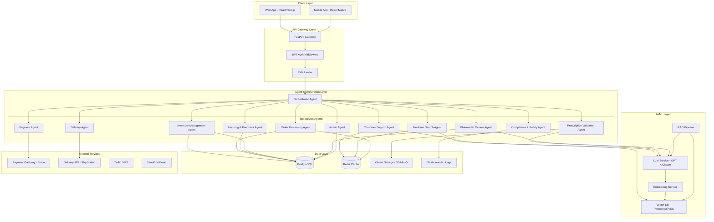
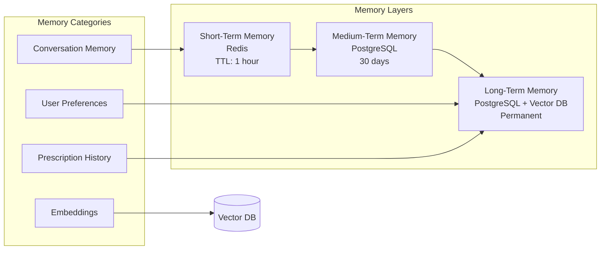
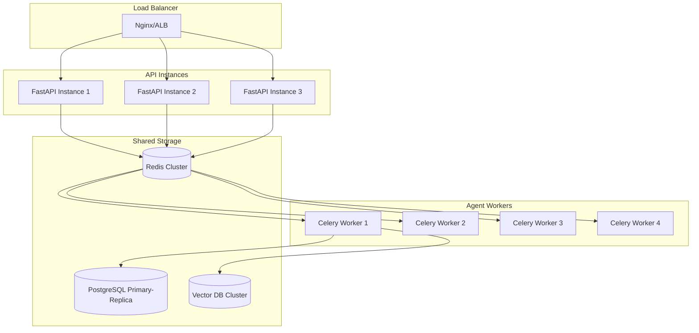
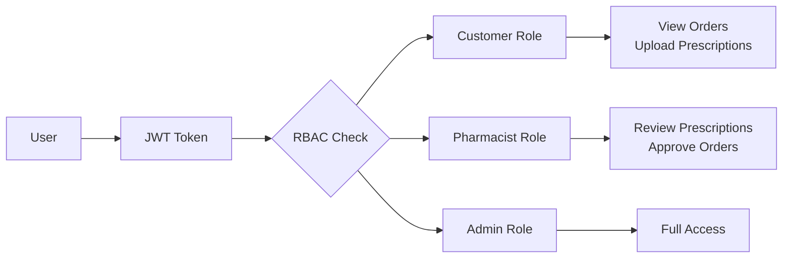

# Agentic Generative AI Online Pharmacy Platform - Architecture

## 1. System Architecture Overview



## 2. Agent Architecture Details

### 2.1 Orchestrator Agent (Central Controller)

**Responsibilities:**
- Route user requests to appropriate specialized agents
- Manage agent lifecycle and state
- Coordinate multi-agent workflows
- Handle agent failures and retries
- Maintain conversation context
- Aggregate responses from multiple agents

**Communication Flow:**
```
User Request → Orchestrator → Agent Selection → Execution → Response Aggregation → User
```

**Memory Types:**
- Short-term: Current conversation session (Redis)
- Long-term: Conversation history (PostgreSQL)
- Vector: Semantic search for similar queries (Pinecone)

### 2.2 Customer Support Agent

**Responsibilities:**
- Handle general inquiries about medicines, policies, shipping
- Provide dosage guidance (general, not medical advice)
- Answer FAQ using RAG
- Escalate to human when needed
- Track customer satisfaction

**Tools:**
- `search_faq(query: str)` - Search FAQ knowledge base
- `get_order_status(order_id: str)` - Check order status
- `escalate_to_human(reason: str)` - Human handoff
- `send_notification(user_id: str, message: str)` - Send updates

**System Prompt:**
```python
CUSTOMER_SUPPORT_PROMPT = """
You are a helpful pharmacy customer support assistant. Your role is to:
1. Answer questions about medicines, shipping, returns, and policies
2. Provide general information about OTC products
3. NEVER provide medical advice or diagnose conditions
4. Always suggest consulting a healthcare professional for medical questions
5. Be empathetic, clear, and concise
6. Use the FAQ knowledge base for accurate information

Safety Guidelines:
- Do not recommend prescription medications
- Do not provide dosage for prescription drugs
- Always include a disclaimer for medical-related queries
- Escalate complex medical questions to pharmacists

Response Format: JSON with fields: response, confidence, escalation_needed
"""
```

### 2.3 Medicine Search Agent

**Responsibilities:**
- Semantic search for medicines
- Filter by category, price, availability
- Provide medicine details (ingredients, usage, side effects)
- Check drug interactions
- Recommend alternatives

**Tools:**
- `semantic_search(query: str, filters: dict)` - Vector search
- `get_medicine_details(medicine_id: str)` - Detailed info
- `check_interactions(medicine_ids: list)` - Drug interaction check
- `get_alternatives(medicine_id: str)` - Similar medicines

**Input Schema:**
```json
{
  "query": "string - natural language search",
  "filters": {
    "category": "string | null",
    "price_min": "number | null",
    "price_max": "number | null",
    "in_stock_only": "boolean",
    "otc_only": "boolean"
  },
  "user_id": "string - for personalization"
}
```

**Output Schema:**
```json
{
  "results": [
    {
      "medicine_id": "string",
      "name": "string",
      "description": "string",
      "price": "number",
      "in_stock": "boolean",
      "category": "string",
      "confidence_score": "number",
      "interaction_warning": "string | null"
    }
  ],
  "total_count": "number",
  "suggestions": ["string"]
}
```

### 2.4 Prescription Validation Agent

**Responsibilities:**
- Extract information from prescription images/PDFs
- Validate prescription format and required fields
- Check for tampering or fraud indicators
- Verify doctor credentials (if API available)
- Check prescription expiration
- Flag controlled substances

**Tools:**
- `extract_prescription(file_url: str)` - OCR extraction
- `validate_format(extracted_data: dict)` - Format validation
- `check_doctor_license(npi: str)` - Verify doctor
- `flag_controlled_substances(medicine_ids: list)` - Safety check
- `store_prescription(user_id: str, data: dict)` - Save to DB

**Input Schema:**
```json
{
  "prescription_file": "string - URL or base64",
  "file_type": "enum: image | pdf",
  "user_id": "string",
  "uploaded_at": "datetime"
}
```

**Output Schema:**
```json
{
  "validation_status": "enum: valid | invalid | needs_review",
  "confidence": "number",
  "extracted_data": {
    "patient_name": "string",
    "doctor_name": "string",
    "doctor_npi": "string",
    "medicines": [{"name": "string", "dosage": "string", "quantity": "number"}],
    "issue_date": "date",
    "expiration_date": "date",
    "pharmacy_notes": "string"
  },
  "flags": ["string"],
  "error_message": "string | null"
}
```

### 2.5 Pharmacist Review Agent

**Responsibilities:**
- Queue prescriptions for pharmacist review
- Prioritize based on urgency and risk
- Summarize patient history for pharmacist
- Flag potential issues (interactions, allergies)
- Track review status and outcomes

**Tools:**
- `get_pending_reviews()` - Fetch queue
- `get_patient_history(user_id: str)` - Medical history
- `create_review_task(prescription_id: str)` - Create task
- `notify_pharmacist(pharmacist_id: str, task: dict)` - Alert

### 2.6 Inventory Management Agent

**Responsibilities:**
- Track stock levels in real-time
- Predict demand using ML
- Generate purchase orders
- Alert on low stock
- Manage expiry dates
- Coordinate with suppliers

**Tools:**
- `get_stock_level(medicine_id: str)` - Current stock
- `update_stock(medicine_id: str, quantity: int)` - Update inventory
- `predict_demand(medicine_id: str, days: int)` - ML prediction
- `create_purchase_order(items: list)` - Generate PO
- `check_expiring_soon(days: int)` - Expiry alerts

### 2.7 Order Processing Agent

**Responsibilities:**
- Create and manage orders
- Validate cart items
- Check prescription requirements
- Calculate totals with taxes/shipping
- Handle order status updates
- Process refunds

**Tools:**
- `create_order(user_id: str, items: list)` - Create order
- `validate_cart(cart: dict)` - Validation
- `apply_coupon(order_id: str, code: str)` - Discounts
- `update_status(order_id: str, status: str)` - Status change
- `calculate_shipping(address: dict, weight: float)` - Shipping cost

### 2.8 Payment Agent

**Responsibilities:**
- Process payments securely
- Handle multiple payment methods
- Manage refunds
- Detect fraud
- Generate invoices
- Handle payment failures

**Tools:**
- `process_payment(order_id: str, method: dict)` - Charge
- `refund_payment(payment_id: str, amount: float)` - Refund
- `verify_payment(payment_id: str)` - Verify
- `generate_invoice(order_id: str)` - Invoice PDF
- `fraud_check(transaction: dict)` - Risk assessment

### 2.9 Delivery Agent

**Responsibilities:**
- Coordinate with delivery services
- Track shipments
- Provide delivery estimates
- Handle delivery exceptions
- Manage delivery preferences

**Tools:**
- `create_shipment(order_id: str, address: dict)` - Create label
- `track_shipment(tracking_number: str)` - Get status
- `update_delivery_preference(user_id: str, prefs: dict)` - Preferences
- `handle_exception(tracking_number: str, issue: str)` - Issues

### 2.10 Compliance & Safety Agent

**Responsibilities:**
- Enforce HIPAA compliance
- Audit all agent actions
- Detect PII in logs
- Ensure data retention policies
- Generate compliance reports
- Flag suspicious activities

**Tools:**
- `audit_log(action: dict)` - Log action
- `detect_pii(text: str)` - PII detection
- `anonymize_data(data: dict)` - Data anonymization
- `generate_compliance_report(start: date, end: date)` - Reports
- `check_data_retention()` - Retention enforcement

### 2.11 Learning & Feedback Agent

**Responsibilities:**
- Collect user feedback
- Analyze agent performance
- Identify improvement areas
- Fine-tune models
- A/B test responses
- Update knowledge base

**Tools:**
- `collect_feedback(interaction_id: str, rating: int)` - Feedback
- `analyze_performance(agent_type: str, period: str)` - Analytics
- `update_knowledge_base(content: dict)` - KB update
- `fine_tune_model(training_data: list)` - Model training

### 2.12 Admin Agent

**Responsibilities:**
- Manage medicine catalog
- User management
- View analytics
- Configure agents
- Handle system settings
- Generate reports

**Tools:**
- `add_medicine(data: dict)` - Add product
- `update_medicine(id: str, data: dict)` - Update product
- `manage_user(user_id: str, action: str)` - User actions
- `get_analytics(metric: str, period: str)` - Analytics
- `configure_agent(agent_type: str, config: dict)` - Config

## 3. Communication Flow

### 3.1 Message Bus Architecture

```python
class MessageBus:
    """Redis-based message bus for agent communication"""
    
    async def publish(self, channel: str, message: AgentMessage):
        await self.redis.publish(channel, message.json())
    
    async def subscribe(self, channel: str, handler: Callable):
        pubsub = self.redis.pubsub()
        await pubsub.subscribe(channel)
        async for message in pubsub.listen():
            if message['type'] == 'message':
                await handler(AgentMessage.parse(message['data']))
```

### 3.2 Agent Message Format

```json
{
  "message_id": "uuid",
  "timestamp": "iso_datetime",
  "sender": "agent_type",
  "recipient": "agent_type | broadcast",
  "conversation_id": "uuid",
  "message_type": "request | response | event | error",
  "payload": {},
  "metadata": {
    "priority": "low | normal | high | urgent",
    "ttl": "seconds",
    "retry_count": 0
  }
}
```

### 3.3 Workflow Example: Prescription Order

```
1. User uploads prescription
   → Orchestrator → Prescription Validation Agent
   
2. Prescription validated
   → Orchestrator → Pharmacist Review Agent (queue)
   
3. Pharmacist approves
   → Orchestrator → Medicine Search Agent (find medicines)
   
4. User adds to cart
   → Orchestrator → Order Processing Agent
   
5. Order created
   → Orchestrator → Inventory Management Agent (reserve stock)
   
6. Payment initiated
   → Orchestrator → Payment Agent
   
7. Payment confirmed
   → Orchestrator → Delivery Agent (create shipment)
   
8. Order complete
   → Orchestrator → Compliance Agent (audit log)
```

## 4. Memory System Architecture

### 4.1 Memory Types



### 4.2 Memory Implementation

```python
class MemoryManager:
    def __init__(self):
        self.short_term = RedisMemory()
        self.long_term = PostgresMemory()
        self.vector = VectorMemory()
    
    async def store_conversation(self, user_id: str, message: dict):
        # Store in short-term for quick access
        await self.short_term.setex(
            f"conv:{user_id}:{message['id']}",
            ttl=3600,
            value=message
        )
        
        # Store in long-term for history
        await self.long_term.insert('conversations', {
            'user_id': user_id,
            'message': message,
            'timestamp': datetime.utcnow()
        })
        
        # Store embedding for semantic search
        embedding = await self.embed(message['content'])
        await self.vector.upsert(
            id=f"conv:{message['id']}",
            vector=embedding,
            metadata={'user_id': user_id, 'timestamp': message['timestamp']}
        )
    
    async def retrieve_context(self, user_id: str, query: str, limit: int = 5):
        # Get recent conversation from short-term
        recent = await self.short_term.get_recent(f"conv:{user_id}:*", limit)
        
        # Get semantically similar from vector DB
        query_embedding = await self.embed(query)
        similar = await self.vector.search(query_embedding, limit)
        
        # Merge and deduplicate
        return self.merge_context(recent, similar)
```

## 5. Error Handling & Resilience

### 5.1 Error Handling Strategy

```python
class AgentErrorHandler:
    async def handle_error(self, agent: BaseAgent, error: Exception, context: dict):
        error_type = self.classify_error(error)
        
        if error_type == ErrorType.TRANSIENT:
            # Retry with exponential backoff
            await self.retry_with_backoff(agent, context)
        
        elif error_type == ErrorType.AGENT_FAILURE:
            # Failover to backup agent
            await self.failover_to_backup(agent, context)
        
        elif error_type == ErrorType.LLM_HALLUCINATION:
            # Validate and retry with stricter prompt
            await self.retry_with_validation(agent, context)
        
        elif error_type == ErrorType.COMPLIANCE_VIOLATION:
            # Log and escalate immediately
            await self.escalate_compliance_issue(error, context)
        
        else:
            # Default: escalate to human
            await self.escalate_to_human(error, context)
```

### 5.2 Circuit Breaker Pattern

```python
from circuitbreaker import circuit

class AgentClient:
    @circuit(failure_threshold=5, recovery_timeout=60)
    async def call_agent(self, agent: BaseAgent, request: dict):
        return await agent.process(request)
```

## 6. Scalability Design

### 6.1 Horizontal Scaling



### 6.2 Agent Pooling

```python
class AgentPool:
    """Manage pool of agent instances for scalability"""
    
    def __init__(self, agent_class: Type, pool_size: int = 10):
        self.agent_class = agent_class
        self.pool = asyncio.Queue()
        self._initialize_pool(pool_size)
    
    def _initialize_pool(self, size: int):
        for _ in range(size):
            agent = self.agent_class()
            self.pool.put_nowait(agent)
    
    async def acquire(self) -> BaseAgent:
        return await self.pool.get()
    
    async def release(self, agent: BaseAgent):
        await self.pool.put(agent)
    
    @asynccontextmanager
    async def get_agent(self):
        agent = await self.acquire()
        try:
            yield agent
        finally:
            await self.release(agent)
```

## 7. Security Architecture

### 7.1 Authentication & Authorization



### 7.2 Data Encryption

```python
class SecurityManager:
    def __init__(self):
        self.encryption_key = os.environ['ENCRYPTION_KEY']
        self.fernet = Fernet(self.encryption_key)
    
    def encrypt_pii(self, data: str) -> str:
        """Encrypt PII before storage"""
        return self.fernet.encrypt(data.encode()).decode()
    
    def decrypt_pii(self, encrypted: str) -> str:
        """Decrypt PII for authorized access"""
        return self.fernet.decrypt(encrypted.encode()).decode()
    
    def hash_sensitive(self, data: str) -> str:
        """One-way hash for sensitive data"""
        return hashlib.sha256(data.encode()).hexdigest()
```

## 8. Monitoring & Observability

### 8.1 Metrics Collection

```python
class AgentMetrics:
    def __init__(self):
        self.metrics = {
            'request_count': Counter('agent_requests_total', 'Total requests', ['agent_type']),
            'latency': Histogram('agent_latency_seconds', 'Request latency', ['agent_type']),
            'error_rate': Counter('agent_errors_total', 'Total errors', ['agent_type', 'error_type']),
            'token_usage': Counter('llm_tokens_total', 'LLM token usage', ['agent_type', 'model']),
        }
    
    def record_request(self, agent_type: str, latency: float):
        self.metrics['request_count'].labels(agent_type=agent_type).inc()
        self.metrics['latency'].labels(agent_type=agent_type).observe(latency)
```

### 8.2 Distributed Tracing

```python
from opentelemetry import trace

tracer = trace.get_tracer(__name__)

class TracedAgent(BaseAgent):
    async def process(self, request: dict):
        with tracer.start_as_current_span(f"{self.agent_type}.process") as span:
            span.set_attribute("agent.type", self.agent_type)
            span.set_attribute("request.id", request.get('id'))
            
            result = await super().process(request)
            
            span.set_attribute("response.success", result.success)
            return result
```

---

This architecture provides a robust, scalable, and secure foundation for the Agentic AI Online Pharmacy Platform.
